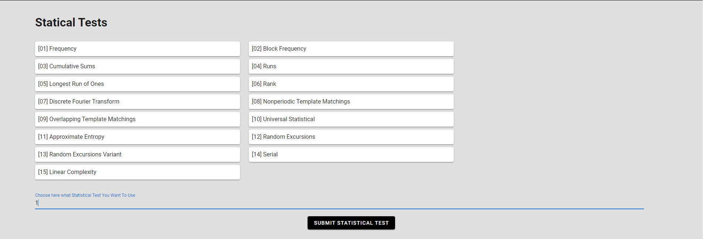
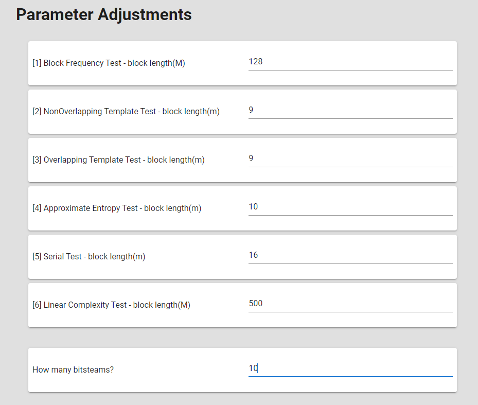

# FinalDegreeProject

Final degree project from Seppe De Witte &amp; Robin Debel at Universitat des illes baleares.

## How to run the project

There are quite a few things you need to have done before you can run the project.

1. Make sure you have linux subsystem for windows enabled on your computer and install ubuntu. You can find the instructions [here](https://www.ubuntu.com/download/desktop).

2. Make sure you installed NGSPICE on your ubuntu for windows. You can find the instructions [here](https://www.ngspice.org/download/).

3. Have node.js installed. You can find the instructions [here](https://nodejs.org/en/).

4. Run the following commands in the terminal in the Frontend folder: `npm install` and `npm run serve`.

5. Run the following commands in the terminal in the Backend folder: `npm install` and `npm run start`.

After following these steps the project should be running.

## Backend

### API routes


## Frontend

### Login/Register

Login:


Register:


### NIST







When everything works you should receive the following mail:


In the mail are following attachments:

* `FinalAnalysisReport.txt`

```text
------------------------------------------------------------------------------
RESULTS FOR THE UNIFORMITY OF P-VALUES AND THE PROPORTION OF PASSING SEQUENCES
------------------------------------------------------------------------------
   generator is <../Backend/data/uploads/1655295875578data.pi>
------------------------------------------------------------------------------
 C1  C2  C3  C4  C5  C6  C7  C8  C9 C10  P-VALUE  PROPORTION  STATISTICAL TEST
------------------------------------------------------------------------------
  1   1   3   0   0   2   1   0   1   1  0.534146     10/10      Frequency
  1   2   1   0   2   2   1   0   1   0  0.739918     10/10      BlockFrequency
  1   1   1   2   1   0   0   2   1   1  0.911413     10/10      CumulativeSums
  1   2   0   1   1   1   1   2   1   0  0.911413     10/10      CumulativeSums
  0   4   1   1   0   2   0   1   0   1  0.122325     10/10      Runs
  0   1   0   4   1   0   1   1   1   1  0.213309     10/10      LongestRun
  1   1   0   1   1   1   2   1   0   2  0.911413     10/10      Rank
  2   1   0   0   2   1   1   1   2   0  0.739918     10/10      FFT
  1   2   1   0   2   2   1   1   0   0  0.739918     10/10      NonOverlappingTemplate
  1   3   0   0   3   3   0   0   0   0  0.035174     10/10      NonOverlappingTemplate
  3   1   1   0   0   1   0   3   0   1  0.213309     10/10      NonOverlappingTemplate
  2   0   1   2   1   0   1   2   1   0  0.739918     10/10      NonOverlappingTemplate
  0   2   1   1   0   2   1   1   2   0  0.739918     10/10      NonOverlappingTemplate
  1   1   1   1   0   1   0   2   2   1  0.911413     10/10      NonOverlappingTemplate
  0   2   1   1   1   2   1   0   1   1  0.911413     10/10      NonOverlappingTemplate
  2   1   1   1   1   0   1   3   0   0  0.534146     10/10      NonOverlappingTemplate
  1   0   1   1   1   2   1   0   2   1  0.911413      9/10      NonOverlappingTemplate
  0   0   2   1   0   1   1   4   1   0  0.122325     10/10      NonOverlappingTemplate
  0   2   0   2   0   1   2   1   1   1  0.739918     10/10      NonOverlappingTemplate
  2   1   1   1   1   1   0   0   2   1  0.911413     10/10      NonOverlappingTemplate
  1   1   3   1   0   1   1   1   1   0  0.739918     10/10      NonOverlappingTemplate
  4   0   1   0   0   1   1   1   0   2  0.122325      9/10      NonOverlappingTemplate
  1   2   1   0   1   2   1   0   0   2  0.739918     10/10      NonOverlappingTemplate
  3   0   1   1   1   1   0   2   1   0  0.534146     10/10      NonOverlappingTemplate
  2   1   0   0   2   1   1   2   0   1  0.739918      9/10      NonOverlappingTemplate
  0   0   1   3   1   2   0   1   1   1  0.534146     10/10      NonOverlappingTemplate
  0   1   1   1   1   0   0   2   3   1  0.534146     10/10      NonOverlappingTemplate
  1   1   0   2   1   1   1   0   2   1  0.911413      9/10      NonOverlappingTemplate
  0   1   2   0   1   1   1   2   2   0  0.739918     10/10      NonOverlappingTemplate
  0   0   0   2   3   1   2   2   0   0  0.213309     10/10      NonOverlappingTemplate
  2   0   1   5   0   1   0   0   1   0  0.008879      9/10      NonOverlappingTemplate
  1   1   3   1   0   1   1   0   2   0  0.534146     10/10      NonOverlappingTemplate
  4   2   1   0   2   0   0   0   1   0  0.066882     10/10      NonOverlappingTemplate
  5   1   1   1   0   0   1   0   0   1  0.017912     10/10      NonOverlappingTemplate
  2   1   2   1   1   1   0   1   1   0  0.911413     10/10      NonOverlappingTemplate
  3   2   0   1   1   1   1   1   0   0  0.534146      9/10      NonOverlappingTemplate
  1   1   1   0   1   0   4   1   1   0  0.213309     10/10      NonOverlappingTemplate
  0   1   2   1   1   1   1   1   1   1  0.991468     10/10      NonOverlappingTemplate
  0   1   1   1   2   0   1   0   2   2  0.739918     10/10      NonOverlappingTemplate
  2   1   1   1   1   2   2   0   0   0  0.739918     10/10      NonOverlappingTemplate
  0   0   1   0   2   3   0   0   2   2  0.213309     10/10      NonOverlappingTemplate
  0   1   1   1   1   1   2   2   0   1  0.911413     10/10      NonOverlappingTemplate
  1   1   0   0   0   2   4   2   0   0  0.066882     10/10      NonOverlappingTemplate
  0   2   1   1   2   0   2   0   2   0  0.534146     10/10      NonOverlappingTemplate
  0   1   0   1   2   2   1   2   0   1  0.739918     10/10      NonOverlappingTemplate
  1   0   1   1   0   0   1   2   0   4  0.122325     10/10      NonOverlappingTemplate
  2   2   0   0   2   1   2   0   1   0  0.534146      9/10      NonOverlappingTemplate
  2   0   1   1   2   1   1   0   1   1  0.911413     10/10      NonOverlappingTemplate
  2   0   5   0   0   2   1   0   0   0  0.004301      9/10      NonOverlappingTemplate
  0   0   1   1   1   0   2   3   1   1  0.534146     10/10      NonOverlappingTemplate
  2   1   2   1   1   0   0   0   1   2  0.739918      9/10      NonOverlappingTemplate
  1   0   2   1   0   0   5   1   0   0  0.008879     10/10      NonOverlappingTemplate
  0   2   1   1   2   2   0   1   0   1  0.739918     10/10      NonOverlappingTemplate
  1   0   1   3   0   2   0   1   0   2  0.350485     10/10      NonOverlappingTemplate
  1   2   1   1   1   0   0   1   1   2  0.911413     10/10      NonOverlappingTemplate
  2   0   1   0   1   0   0   4   0   2  0.066882     10/10      NonOverlappingTemplate
  0   0   0   2   1   1   3   2   1   0  0.350485     10/10      NonOverlappingTemplate
  2   1   2   1   0   2   1   0   1   0  0.739918     10/10      NonOverlappingTemplate
  3   1   0   2   0   0   1   1   0   2  0.350485     10/10      NonOverlappingTemplate
  0   1   2   1   1   0   1   2   0   2  0.739918     10/10      NonOverlappingTemplate
  0   1   1   1   3   1   0   2   1   0  0.534146     10/10      NonOverlappingTemplate
  1   0   1   0   1   1   1   1   3   1  0.739918     10/10      NonOverlappingTemplate
  1   1   3   2   0   0   1   0   2   0  0.350485     10/10      NonOverlappingTemplate
  1   0   1   1   0   1   1   1   2   2  0.911413     10/10      NonOverlappingTemplate
  2   0   2   0   0   1   2   2   0   1  0.534146     10/10      NonOverlappingTemplate
  1   1   1   0   1   1   0   1   3   1  0.739918     10/10      NonOverlappingTemplate
  1   1   1   1   1   0   2   0   1   2  0.911413     10/10      NonOverlappingTemplate
  1   1   3   1   0   1   1   2   0   0  0.534146     10/10      NonOverlappingTemplate
  0   2   1   0   0   0   2   2   1   2  0.534146     10/10      NonOverlappingTemplate
  1   1   0   2   2   0   1   0   1   2  0.739918     10/10      NonOverlappingTemplate
  0   0   0   0   4   1   3   0   1   1  0.035174     10/10      NonOverlappingTemplate
  2   1   3   0   0   1   1   0   0   2  0.350485     10/10      NonOverlappingTemplate
  0   1   1   2   0   1   0   0   3   2  0.350485     10/10      NonOverlappingTemplate
  0   1   0   1   1   2   0   1   2   2  0.739918     10/10      NonOverlappingTemplate
  1   3   0   3   0   2   0   1   0   0  0.122325     10/10      NonOverlappingTemplate
  1   2   0   0   2   1   2   1   1   0  0.739918     10/10      NonOverlappingTemplate
  0   1   0   2   1   2   1   2   0   1  0.739918     10/10      NonOverlappingTemplate
  0   2   0   1   1   1   3   1   1   0  0.534146     10/10      NonOverlappingTemplate
  1   2   2   1   1   1   0   0   1   1  0.911413     10/10      NonOverlappingTemplate
  1   1   1   4   1   1   0   1   0   0  0.213309     10/10      NonOverlappingTemplate
  0   0   0   1   3   1   0   3   2   0  0.122325     10/10      NonOverlappingTemplate
  0   1   1   2   1   1   1   2   0   1  0.911413     10/10      NonOverlappingTemplate
  1   2   1   0   2   2   1   1   0   0  0.739918     10/10      NonOverlappingTemplate
  3   1   2   1   0   0   0   1   0   2  0.350485     10/10      NonOverlappingTemplate
  1   0   1   2   2   1   0   1   1   1  0.911413     10/10      NonOverlappingTemplate
  0   1   1   1   2   1   3   1   0   0  0.534146     10/10      NonOverlappingTemplate
  0   3   1   0   2   2   1   0   1   0  0.350485     10/10      NonOverlappingTemplate
  1   0   0   0   3   3   1   1   0   1  0.213309     10/10      NonOverlappingTemplate
  2   0   1   1   1   1   1   1   1   1  0.991468     10/10      NonOverlappingTemplate
  1   1   1   1   0   1   0   2   1   2  0.911413     10/10      NonOverlappingTemplate
  1   2   0   0   0   3   2   1   0   1  0.350485     10/10      NonOverlappingTemplate
  0   1   0   1   0   0   1   2   3   2  0.350485     10/10      NonOverlappingTemplate
  1   0   2   1   3   0   1   2   0   0  0.350485     10/10      NonOverlappingTemplate
  0   2   2   1   1   1   1   0   1   1  0.911413     10/10      NonOverlappingTemplate
  0   1   0   3   0   0   1   3   1   1  0.213309     10/10      NonOverlappingTemplate
  2   2   3   1   0   0   1   1   0   0  0.350485     10/10      NonOverlappingTemplate
  2   1   0   0   0   0   0   1   2   4  0.066882     10/10      NonOverlappingTemplate
  1   1   0   0   1   3   1   1   0   2  0.534146     10/10      NonOverlappingTemplate
  0   1   0   2   1   0   4   1   0   1  0.122325     10/10      NonOverlappingTemplate
  0   4   0   0   1   1   1   0   2   1  0.122325     10/10      NonOverlappingTemplate
  1   1   0   1   1   1   1   2   0   2  0.911413     10/10      NonOverlappingTemplate
  2   2   2   0   2   0   1   0   1   0  0.534146     10/10      NonOverlappingTemplate
  0   1   3   1   0   1   2   0   0   2  0.350485     10/10      NonOverlappingTemplate
  1   2   0   0   1   1   1   0   1   3  0.534146     10/10      NonOverlappingTemplate
  2   0   1   1   1   1   2   0   0   2  0.739918     10/10      NonOverlappingTemplate
  0   2   1   1   0   1   2   2   0   1  0.739918     10/10      NonOverlappingTemplate
  0   0   4   1   1   0   1   1   0   2  0.122325     10/10      NonOverlappingTemplate
  1   1   1   0   2   2   0   1   2   0  0.739918     10/10      NonOverlappingTemplate
  2   1   1   1   0   1   1   0   0   3  0.534146      9/10      NonOverlappingTemplate
  0   1   0   1   0   1   1   0   3   3  0.213309     10/10      NonOverlappingTemplate
  1   1   2   1   1   1   0   2   0   1  0.911413     10/10      NonOverlappingTemplate
  0   2   0   0   1   0   3   1   2   1  0.350485     10/10      NonOverlappingTemplate
  3   0   1   1   1   0   1   1   1   1  0.739918     10/10      NonOverlappingTemplate
  1   1   1   1   1   0   0   2   1   2  0.911413     10/10      NonOverlappingTemplate
  2   2   0   0   0   1   2   1   1   1  0.739918     10/10      NonOverlappingTemplate
  0   0   1   2   2   0   2   1   2   0  0.534146     10/10      NonOverlappingTemplate
  1   1   0   2   1   1   0   2   1   1  0.911413     10/10      NonOverlappingTemplate
  0   2   0   1   3   1   1   2   0   0  0.350485     10/10      NonOverlappingTemplate
  2   1   1   1   2   0   0   2   1   0  0.739918      9/10      NonOverlappingTemplate
  0   1   2   0   1   3   1   0   2   0  0.350485     10/10      NonOverlappingTemplate
  1   1   0   1   2   0   3   1   1   0  0.534146     10/10      NonOverlappingTemplate
  2   0   1   1   0   0   1   0   2   3  0.350485     10/10      NonOverlappingTemplate
  1   0   0   1   0   0   1   4   2   1  0.122325     10/10      NonOverlappingTemplate
  0   2   0   3   1   3   0   0   0   1  0.122325     10/10      NonOverlappingTemplate
  0   0   2   1   2   2   1   1   0   1  0.739918     10/10      NonOverlappingTemplate
  1   1   1   3   0   0   2   1   0   1  0.534146     10/10      NonOverlappingTemplate
  1   1   1   0   1   1   2   0   3   0  0.534146     10/10      NonOverlappingTemplate
  3   0   1   3   1   1   0   0   0   1  0.213309     10/10      NonOverlappingTemplate
  1   1   3   1   0   2   0   1   0   1  0.534146     10/10      NonOverlappingTemplate
  1   0   0   2   3   1   1   1   0   1  0.534146     10/10      NonOverlappingTemplate
  0   0   2   0   2   1   1   1   2   1  0.739918     10/10      NonOverlappingTemplate
  1   3   1   0   1   1   0   0   3   0  0.213309     10/10      NonOverlappingTemplate
  1   0   2   2   1   1   1   1   0   1  0.911413     10/10      NonOverlappingTemplate
  2   2   1   1   0   2   1   0   1   0  0.739918     10/10      NonOverlappingTemplate
  1   1   4   1   1   0   0   1   0   1  0.213309     10/10      NonOverlappingTemplate
  0   3   0   0   0   0   1   1   2   3  0.122325     10/10      NonOverlappingTemplate
  0   0   0   1   4   1   1   2   0   1  0.122325     10/10      NonOverlappingTemplate
  4   2   1   1   0   1   0   0   1   0  0.122325     10/10      NonOverlappingTemplate
  0   1   2   2   0   1   0   1   1   2  0.739918     10/10      NonOverlappingTemplate
  0   1   2   1   2   1   1   1   1   0  0.911413     10/10      NonOverlappingTemplate
  1   0   1   0   0   0   2   0   1   5  0.008879     10/10      NonOverlappingTemplate
  2   0   3   2   0   0   1   0   2   0  0.213309      9/10      NonOverlappingTemplate
  4   1   2   1   1   0   0   0   0   1  0.122325      9/10      NonOverlappingTemplate
  2   2   1   1   0   2   0   1   0   1  0.739918     10/10      NonOverlappingTemplate
  0   1   0   1   5   1   0   1   0   1  0.017912     10/10      NonOverlappingTemplate
  0   0   0   2   0   1   3   1   2   1  0.350485     10/10      NonOverlappingTemplate
  0   1   1   1   0   1   3   1   1   1  0.739918     10/10      NonOverlappingTemplate
  1   0   1   1   1   2   2   0   2   0  0.739918     10/10      NonOverlappingTemplate
  2   0   0   0   0   1   2   2   1   2  0.534146     10/10      NonOverlappingTemplate
  1   0   2   1   0   1   2   0   1   2  0.739918     10/10      NonOverlappingTemplate
  1   0   1   0   1   3   2   0   1   1  0.534146     10/10      NonOverlappingTemplate
  1   0   0   0   2   2   1   3   1   0  0.350485     10/10      NonOverlappingTemplate
  2   2   1   0   0   2   1   0   1   1  0.739918     10/10      NonOverlappingTemplate
  3   2   0   3   0   1   0   0   1   0  0.122325     10/10      NonOverlappingTemplate
  2   2   0   2   0   2   2   0   0   0  0.350485     10/10      NonOverlappingTemplate
  0   1   1   2   1   1   1   2   0   1  0.911413     10/10      NonOverlappingTemplate
  4   0   1   2   0   1   0   0   0   2  0.066882      9/10      OverlappingTemplate
 10   0   0   0   0   0   0   0   0   0  0.000000 *    0/10   *  Universal
  0   1   1   2   0   1   3   1   1   0  0.534146     10/10      ApproximateEntropy
  0   2   0   0   0   0   0   0   0   0     ----       2/2       RandomExcursions
  0   0   0   0   1   0   1   0   0   0     ----       2/2       RandomExcursions
  0   0   0   0   1   0   0   1   0   0     ----       2/2       RandomExcursions
  0   0   0   0   0   0   1   1   0   0     ----       2/2       RandomExcursions
  0   0   1   0   0   0   0   1   0   0     ----       2/2       RandomExcursions
  0   0   1   0   0   0   0   0   0   1     ----       2/2       RandomExcursions
  0   0   0   1   0   0   1   0   0   0     ----       2/2       RandomExcursions
  0   1   0   0   1   0   0   0   0   0     ----       2/2       RandomExcursions
  0   0   0   1   0   0   0   1   0   0     ----       2/2       RandomExcursionsVariant
  0   0   0   1   0   0   0   1   0   0     ----       2/2       RandomExcursionsVariant
  0   0   0   1   0   0   0   0   0   1     ----       2/2       RandomExcursionsVariant
  0   0   0   1   0   1   0   0   0   0     ----       2/2       RandomExcursionsVariant
  0   0   0   0   1   1   0   0   0   0     ----       2/2       RandomExcursionsVariant
  0   0   0   0   2   0   0   0   0   0     ----       2/2       RandomExcursionsVariant
  0   0   0   1   1   0   0   0   0   0     ----       2/2       RandomExcursionsVariant
  0   0   0   0   0   1   1   0   0   0     ----       2/2       RandomExcursionsVariant
  0   0   0   0   0   2   0   0   0   0     ----       2/2       RandomExcursionsVariant
  0   1   0   0   0   0   0   0   0   1     ----       2/2       RandomExcursionsVariant
  0   1   0   0   0   0   0   0   1   0     ----       2/2       RandomExcursionsVariant
  0   1   0   1   0   0   0   0   0   0     ----       2/2       RandomExcursionsVariant
  0   1   1   0   0   0   0   0   0   0     ----       2/2       RandomExcursionsVariant
  0   1   0   1   0   0   0   0   0   0     ----       2/2       RandomExcursionsVariant
  0   0   2   0   0   0   0   0   0   0     ----       2/2       RandomExcursionsVariant
  0   0   1   1   0   0   0   0   0   0     ----       2/2       RandomExcursionsVariant
  0   0   1   0   1   0   0   0   0   0     ----       2/2       RandomExcursionsVariant
  0   1   0   0   0   0   1   0   0   0     ----       2/2       RandomExcursionsVariant
  3   0   2   1   0   0   1   0   1   2  0.350485      9/10      Serial
  2   2   1   1   0   2   0   0   0   2  0.534146      9/10      Serial
  2   2   1   0   0   1   1   0   2   1  0.739918     10/10      LinearComplexity


- - - - - - - - - - - - - - - - - - - - - - - - - - - - - - - - - - - - - - - - -
The minimum pass rate for each statistical test with the exception of the
random excursion (variant) test is approximately = 8 for a
sample size = 10 binary sequences.

The minimum pass rate for the random excursion (variant) test
is approximately = 1 for a sample size = 2 binary sequences.

For further guidelines construct a probability table using the MAPLE program
provided in the addendum section of the documentation.
- - - - - - - - - - - - - - - - - - - - - - - - - - - - - - - - - - - - - - - - -
````

* `1655295875578data.log`

```text
       G E N E R A T O R    S E L E C T I O N 
           ______________________________________

    [0] Input File                 [1] Linear Congruential
    [2] Quadratic Congruential I   [3] Quadratic Congruential II
    [4] Cubic Congruential         [5] XOR
    [6] Modular Exponentiation     [7] Blum-Blum-Shub
    [8] Micali-Schnorr             [9] G Using SHA-1

   Enter Choice: 

User Prescribed Input File: 
                S T A T I S T I C A L   T E S T S
                _________________________________

    [01] Frequency                       [02] Block Frequency
    [03] Cumulative Sums                 [04] Runs
    [05] Longest Run of Ones             [06] Rank
    [07] Discrete Fourier Transform      [08] Nonperiodic Template Matchings
    [09] Overlapping Template Matchings  [10] Universal Statistical
    [11] Approximate Entropy             [12] Random Excursions
    [13] Random Excursions Variant       [14] Serial
    [15] Linear Complexity

         INSTRUCTIONS
            Enter 0 if you DO NOT want to apply all of the
            statistical tests to each sequence and 1 if you DO.

   Enter Choice: 
        P a r a m e t e r   A d j u s t m e n t s
        -----------------------------------------
    [1] Block Frequency Test - block length(M):         128
    [2] NonOverlapping Template Test - block length(m): 9
    [3] Overlapping Template Test - block length(m):    9
    [4] Approximate Entropy Test - block length(m):     10
    [5] Serial Test - block length(m):                  16
    [6] Linear Complexity Test - block length(M):       500

   Select Test (0 to continue): 
   Enter Block Frequency Test block length: 
        P a r a m e t e r   A d j u s t m e n t s
        -----------------------------------------
    [1] Block Frequency Test - block length(M):         128
    [2] NonOverlapping Template Test - block length(m): 9
    [3] Overlapping Template Test - block length(m):    9
    [4] Approximate Entropy Test - block length(m):     10
    [5] Serial Test - block length(m):                  16
    [6] Linear Complexity Test - block length(M):       500

   Select Test (0 to continue): 
   Enter NonOverlapping Template Test block Length: 
        P a r a m e t e r   A d j u s t m e n t s
        -----------------------------------------
    [1] Block Frequency Test - block length(M):         128
    [2] NonOverlapping Template Test - block length(m): 9
    [3] Overlapping Template Test - block length(m):    9
    [4] Approximate Entropy Test - block length(m):     10
    [5] Serial Test - block length(m):                  16
    [6] Linear Complexity Test - block length(M):       500

   Select Test (0 to continue): 
   Enter Overlapping Template Test block Length: 
        P a r a m e t e r   A d j u s t m e n t s
        -----------------------------------------
    [1] Block Frequency Test - block length(M):         128
    [2] NonOverlapping Template Test - block length(m): 9
    [3] Overlapping Template Test - block length(m):    9
    [4] Approximate Entropy Test - block length(m):     10
    [5] Serial Test - block length(m):                  16
    [6] Linear Complexity Test - block length(M):       500

   Select Test (0 to continue): 
   Enter Approximate Entropy Test block Length: 
        P a r a m e t e r   A d j u s t m e n t s
        -----------------------------------------
    [1] Block Frequency Test - block length(M):         128
    [2] NonOverlapping Template Test - block length(m): 9
    [3] Overlapping Template Test - block length(m):    9
    [4] Approximate Entropy Test - block length(m):     10
    [5] Serial Test - block length(m):                  16
    [6] Linear Complexity Test - block length(M):       500

   Select Test (0 to continue): 
   Enter Serial Test block Length: 
        P a r a m e t e r   A d j u s t m e n t s
        -----------------------------------------
    [1] Block Frequency Test - block length(M):         128
    [2] NonOverlapping Template Test - block length(m): 9
    [3] Overlapping Template Test - block length(m):    9
    [4] Approximate Entropy Test - block length(m):     10
    [5] Serial Test - block length(m):                  16
    [6] Linear Complexity Test - block length(M):       500

   Select Test (0 to continue): 
   Enter Linear Complexity Test block Length: 
        P a r a m e t e r   A d j u s t m e n t s
        -----------------------------------------
    [1] Block Frequency Test - block length(M):         128
    [2] NonOverlapping Template Test - block length(m): 9
    [3] Overlapping Template Test - block length(m):    9
    [4] Approximate Entropy Test - block length(m):     10
    [5] Serial Test - block length(m):                  16
    [6] Linear Complexity Test - block length(M):       500

   Select Test (0 to continue): 
   How many bitstreams? 
   Input File Format:
    [0] ASCII - A sequence of ASCII 0's and 1's
    [1] Binary - Each byte in data file contains 8 bits of data

   Select input mode:  
     Statistical Testing In Progress.........

     Statistical Testing Complete!!!!!!!!!!!!

```

### CMC


When everything works you should receive the following mail:


In the mail are following attachments:

* `1655296912363rcladder.log`

```text

Circuit: Simple attenuator circuit

Doing analysis at TEMP = 27.000000 and TNOM = 27.000000


No. of Data Rows : 1
v(a) = 1.000000e+02
v(b) = 5.000000e+01
v(a,b) = 5.000000e+01
i(v1) = -5.00000e+00
```

### Profile


